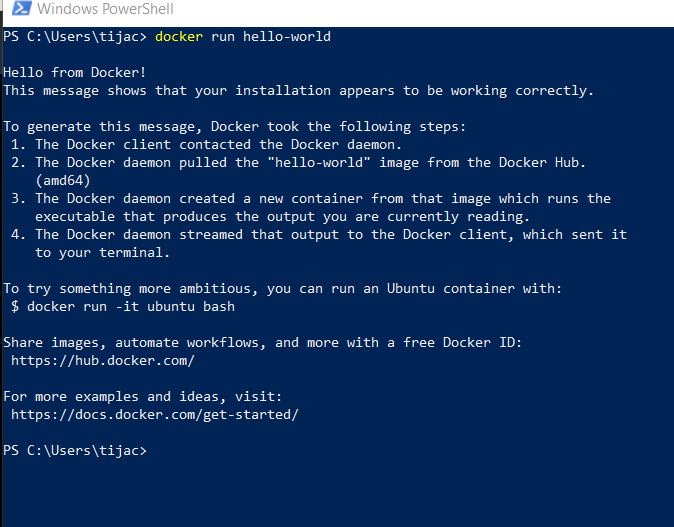

# Projeto Estudos AWS - Rest API Java + Docker + AWS

Esse projeto tem como objetivo integrar alguns conhecimentos através do desenvolvimento de um projeto com Java Spring boot + Banco de dados + Docker + AWS

## Criar conteiner

No PowerShell digitar `docker -v` para confirmar a instalação correta do Docker.

Digite no PowerShell o comando `docker info`, para ter acesso as informações do docker

Vamos agora baixar uma imagem apenas para testar se tudo esta funcionando conforme o esperado com o comando: `docker pull rancher/hello-world`

Após baixar a imagem para teste vamos executar a mesma com o comando: `docker run hello-world`

